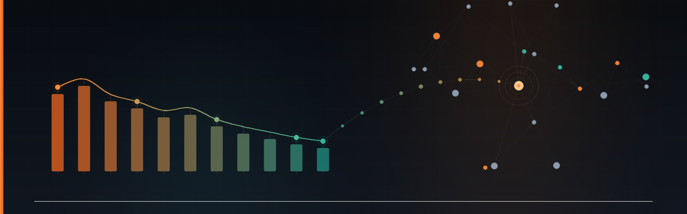

  

  
  
  
  
  

# Acelere sua Aprendizagem com IA: Explore o Poder do NotebookLM

> **AI Engineer | Especialista em Governança 4.0 e Qualidade | Engenheiro Químico**  
> [Mauá, SP](mailto:ornelas.tozato@gmail.com) | [LinkedIn](https://www.linkedin.com/in/rafaeltozato81) | [GitHub](https://github.com/Rafael-TOZATO) | [Portfólio PWA](https://tozato-dev-hub.vercel.app) | [Medium](https://medium.com/@ornelas.tozato)

---

## 1. Contexto e Objetivos
* **Assunto de Interesse:** Análise de crédito, renegociação de dívidas, saneamento de passivos e estratégias de governança financeira pessoal com foco no mapeamento e rastreabilidade.
* **Objetivos de Estudo:**
  1. Explorar o uso de Inteligência Artificial generativa através do NotebookLM como ferramenta de aprendizagem ativa e curadoria de dados financeiros.
  2. Consolidar uma visão sistêmica sobre o endividamento e quitação utilizando relatórios oficiais e métricas de desempenho de portfólio.
  3. Desenvolver competências práticas em engenharia de prompts, análise crítica de fontes institucionais e estruturação de miniguias de estudos aplicados às finanças.

---

## 2. Curadoria de Fontes
O caderno temático foi construído com base em 4 fontes primárias, unindo diretrizes regulatórias, extratos institucionais do Banco Central e relatórios analíticos de apoio:
1. **Guia Oficial do Relatório de Empréstimos e Financiamentos (SCR):** `fontes/guia_oficial_relatorio_emprestimos_bcb_clean.pdf`
2. **Relatório Detalhado SCR (Registrato):** `fontes/relatorio_emprestimos_financiamentos_scr_detalhado.pdf`
3. **Perguntas e Respostas Institucionais (FAQ SCR):** `fontes/faq_relatorio_emprestimos_scr.pdf`
4. **Governança Financeira & Carreira 4.0:** `fontes/governanca_financeira_carreira_4_0.pdf`

---

## 3. Engenharia de Prompts e "Cicatrizes"
* **Perguntas Estratégicas Testadas:**
  * "Com base nos relatórios do SCR e nos dados de controle financeiro anexados, faça uma análise crítica identificando o status de contratos ativos versus quitados."
  * "Explique de forma técnica quais são os critérios estabelecidos pelo Banco Central para consulta, contestação e atualização de informações no Registrato."
* **Dificuldades e Troubleshooting (Cicatrizes):**
  * **Autenticação e Permissões:** Necessidade de validação rigorosa via Conta Gov.br com dupla verificação para liberação de relatórios restritos no Registrato.
  * **Padronização de Nomenclaturas:** Ajuste inicial na limpeza de metadados e remoção de caracteres especiais dos arquivos PDF para assegurar a indexação correta no NotebookLM.

---

## 4. Miniguia de Estudo (Entrega Final)

### Resumo Estruturado do Assunto
* **Visão Sistêmica do Crédito:** O Sistema de Informações de Crédito (SCR) gerido pelo Banco Central atua como um repositório centralizado de dados sobre operações de crédito.
* **Governança e Finanças Pessoais:** O cruzamento de dados oficiais do Registrato com painéis gerenciais próprios permite o mapeamento ativo de passivos e a otimização de portfólio.

### Glossário de Conceitos Aprendidos
* **SCR:** Base de dados nacional do Banco Central que registra o histórico de operações de crédito concedidas pelas instituições financeiras.
* **Registrato:** Sistema eletrônico para consulta gratuita de relatórios de relacionamentos financeiros e chaves Pix.
* **Compliance Pessoal:** Alinhamento da saúde financeira e limpeza de restrições cadastrais para blindagem em auditorias e processos de recrutamento corporativo.

### Conjunto de Prompts Reutilizáveis
1. **Prompt de Auditoria de Passivos:** "Análise o histórico de crédito consolidado e aponte eventuais divergências ou contratos pendentes de baixa sistêmica pelas instituições."
2. **Prompt de Projeção de Recuperação:** "Com base no cronograma de quitação e metas de score, elabore um plano de ação trimestral para blindagem do CPF."

---

## Autor

**Rafael Ornelas Tozato**

Engenharia Química | Garantia da Qualidade | Governança 4.0

### Contato

- LinkedIn: [linkedin.com/in/rafaeltozato81](https://www.linkedin.com/in/rafaeltozato81)
- GitHub: [github.com/Rafael-TOZATO](https://github.com/Rafael-TOZATO)
- Medium: [medium.com/@ornelas.tozato](https://medium.com/@ornelas.tozato)
- Lovable: [aurora-bi-dio.lovable.app](https://aurora-bi-dio.lovable.app)  
